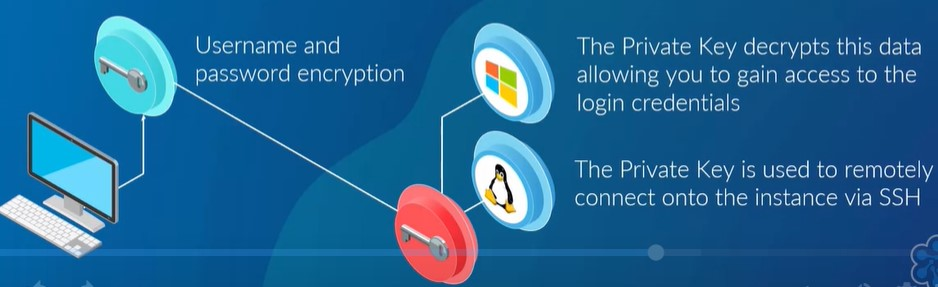

# Introduction

>A physical server within a data center will be considered a compute resource as it may have multiple CPUs and many Gigabytes of RAM

>Compute services can comprise of utilizing hundreds of EC2 Instances(Virtual Servers) which may be used continuously for months or even years processing millions of istructions.

>Compute is closely related to common server components such as CPU & RAM

## Amazon EC2
EC2 Allows you to deploy virtual servers within your AWS environment
### Components of EC2
#### 1. Amazon Machine Images(AMI)
#### 2. Instance types
#### 3. Instance Purchasing Options
#### 4. Tenancy
#### 5. User Data
#### 6. Storage Options
#### 7. Security

### AMI
>>> They are essentially templates of pre-configured EC2 instances which allow you to quickly launch a new instance based on the configuration withinn the AMI.

>>An AMI is an image baseline with an operating system & applications along with any custom configuration.

#### Where to find AMI
- AWS Marketplace: An online store that allows you to purchase AMIs from trusted vendors.
- Community AMIs: Are repositories of AMIs that have been created and shared by other AWS member.

### Intance type:
> Once you've selected AMI from any of the different sources, you MUST select an instance type.
> It defines the size of instance based on the number of different parameters.  i.e ECU, vCPUS, Physical processor, amount of volume, network level status performance, Instance storage

| Instance Type     | Description
| :---              |:---
| Micro Instance    | Have a low cost instance option, providing low amount of CPU resources. Suitable for low throughput applications and websites that requires additional compute cycles periodically. Used for low traffic websites/ blogs, small administrative applications, bastian hosts |
| General Purpose   | Provides a balance of compute, memory and network|
| Compute Optimized |
| FPGA Instance     |
| GPU Instance      |
| Memory Optimized  |
| Storage Optimized |

## Instance: Purchasing Options
### 1. On-Demand Instances
- Can be launched anytime.
- Can be used for as long as needed.
- Flat rate determined on the instance type
- Typically used for short-term uses.
- Best used for testing and development environment.

### 2. Reserved Instance
- Purchases for a short period of time for reduced cost.
  > * Upfront:
  > Compelete payment for 1 or 3 years timeframe.

  > * Partial Upfront:
  > Smaller upfront payment for smaller discount.

  > * No Upfront: The smallest discount is applied.

- Best applied for long-term predictable workload.

### 3. Scheduled Instance
- You pay for reservations on recurring schedule either daily, weekly or monthly.
- You could set up a scheduled instance to run during that set time frame i.e once a week. 
- Note that even if you dint use the instance you will still be charged.

### 4. Spot Instances
- Allows you to pay for unused EC2 compute resources.
- No guarantees for a fx period of time.
- Flactuation of price based on supply and demand.
- Purchase large EC2 instances at a very low price.
- Useful for processing data that can be sudden;y interrupted

### 5. On-Demand Capacity Reservation
- Reserve capacity based on different attributes i.e `instance type`, `platform` and `tenancy` within a particular Availability Zone for any period of time. `This ensures that you always have available number of instances required within a specofic AZ immediately`.
- It could be used inconjuction with your reserved instance discount.

## Tenancy
This relates to what underlying host your instance will reside on, so essentially the physical server within your AWS Data center.

1. Shared Tenacy
- EC2 Instance is launched on any available host with the required resources.
- The same host may be used by multiple customers
- AWS Security mechanism prevent one EC2 Instance accessing another in the same host.
2. Dedicated Instance
- Hosted on hardware that no other customer can access.
- May be required to meet compliance.
- Dedicated instance incur additional charges.

3. Dedicated Host
- Addiditional visibility & control on the physical host.
- Allow to use the same hosts for a number of instances.
- May be required to meet the compliance.

## User Data
>Allows you to enter commands that will run during the first boot cycle of that instance.
> Perform functions upon boot i.e to pull down any additional software you want or download latest OS updates.

## Storage Options
> Selecting storage for your EC2 instances will depend on the instance selected, what you intent to use the instance for and how critical the data is.

### Categories include:
1. Persitent Storage
> Availble by attaching EBS volume.
- EBS Volumes are separated from EC2 Instance.
- These volumes are logically attached via AWS network.
- The data on EBS volume are automatically replicated to other EBS volumes within the same AZ for resiliency which is managed by AWS.
- You can disconnect the volume from the EC2 instance maintaining data. Allowing you to re-attach it to another EC2 isntanceyou require.
- You can implement encryption and take backup snapshots of all data on the volume to S3.

2. Ephemeral Storage /Instance type storage
>Created by EC2 instance using local storage
- Physically attached to the underlying host on which EC2 instance resides on.
- When an instance is stopped or terminated, all saved data on the disk is lost.
- If you reboot your data will remain intact.
- You're unable to detach instance store volumes from the instance.

## Security
Security group of EC2 Instance.
> A security Group is instance level firewall rule that allows you to restrict both ingress and eggress traffic by specifying what traffic is allowed to communicate with it. 

> You can restrict these communication by source, ports and protocols for both inbound and outbound communication.

> More can be found [here](https://cloudacademy.com/blog/aws-security-groups-instance-level-security/#:~:text=AWS%20security%20groups%20(SGs)%20are,out%20of%20an%20EC2%20instance.)

## Key-pair
> Its made up of two component: [public]() and [private]() key.
> It encrypt the login information for Linux and Windows EC2 Instances, and then decrypt the same information allowing you to authenticate onto the instance.

>The [Public key]() is held and kept by AWS, the [Private Key]() is your responsibility to keep and ensure that its not lost or compromised.

> Its possible to use same key on multiple instances

> Its your responsiblity to maintain and install the lastest OS and Security patches released by the security vendors as dictated within the [AWS shared responsibility model](https://aws.amazon.com/compliance/shared-responsibility-model/) / or [here](https://cloudacademy.com/blog/aws-shared-responsibility-model-security/)