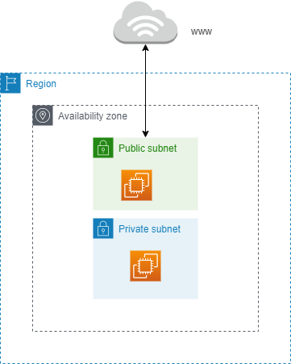
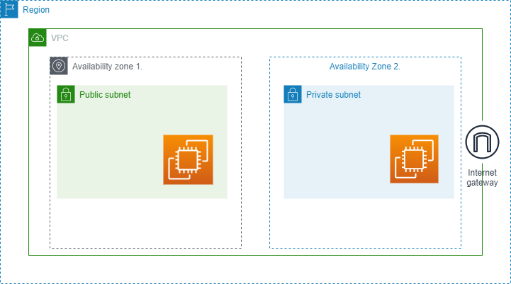
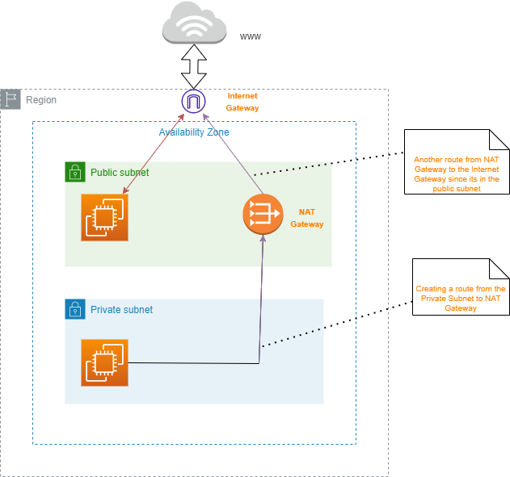

## Introduction to VPC (Virtual Private Cloud)
> A Private network to deploy your resources.
> Inside VPC we have `subnets` which allows partition of network. 
> They are defined at `Availability Zone level`.

> `A Public Subnet:` Is Accessible from the internet while `private subnet` not accessible from the internet.
>
>To define access to the internet and between subnets, we use `Route Tables` which defines how network flows between subnets. 

> VPC has set of IP range known as `CIDR` range i.e ranges of IP addresses allowed within your VPC.

## Internet Gateway
> What makes the subnet public and how can it access the internet ? We use `Internet Gateway` which helps VPC instances connect to the internet. 
>
>Public subnet will have a route to the Internet Gateway, thus making it public. 

>Suppose we have an EC2 Instance in the Private subnet & we want it to access the internet, i.e to get updates for softwares etc, but we do not want it to be accessible from the internet, we use a `NAT Gateway`.
>NAT Gateway(AWS Managed) & NAT Instance(Self Managed) allows your instance in your private subnet to access the internet while remaining private.

Private subnet can now access the internet through the NAT Gateway that connects to the Internet Gateway.